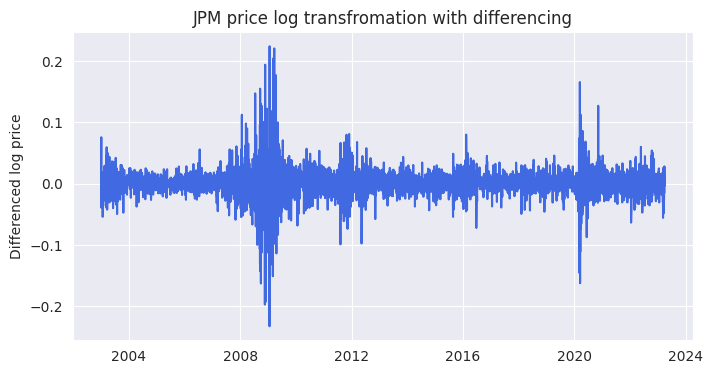
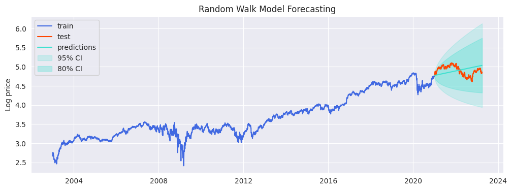
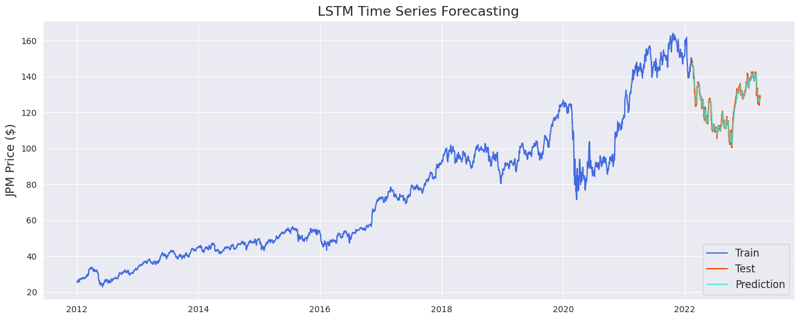

# Bank Stock Price Forecasting & Time Series Analysis

## Part I - EDA

Time series analysis of megabank stock, including BAC, JPM, HSBC, RY... in the past 20 years, from 2003 till 2023.

### Price change over the past 20 years

### 2023 Q1 daily return
It shows 2023 March banking crisis including the collapse of SVB significantly impacted the price drop for major banks.

### Comparison of yearly return among megabanks
For the past 20 years, JPM generates a relative higher and more stable yoy return, outperforming other mega banks. While RBC & PD, as well as MS and GS indicates similar return and risk patterns.  

## Part II - Random Walk & ARIMA Model Forecasting

Forecasting long-term JPM stock price based on the historical price (2003-2021). 

Applied log transformation and first-order differencing to stationarize the price data, to stationarize the data before modeling

 

Applied Random Walk with drift as forecasting model, with MAPE of 15.53% 

(left: forecasting on log price, right: converting to original price )

 

Though Random Walk and ARIMA generates similar MAPE score (~15%), the residuals are still not normally distributed and homoscedastic. Additional transformation and differencing will be needed to further stationarize the data. However, model capture the overall trend in the long term.

Also, the significant impact during 2008 financial crisis and 2020 COVID which causes large variance in the dataset should be considered and adjusted.

Further improvement TBC...

## Part III - LSTM for Time Series Forecasting

Forecasting short-term JPM stock price based on the past 60-day close price.

